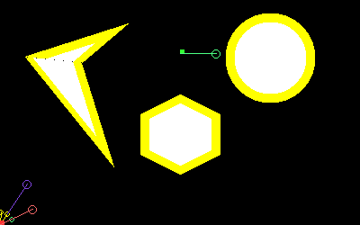

# Project 3
Name: Aswath Muthuselvam
- UID: 118286204
- Section: 0201

Name: Gokul Hari
- UID: 117430646
- Section: 0301

- Course: ENPM 661 - Planning for Autonomous Robots

## A-Star Algorithm for Path Planning
### Run Algorithm:
```bash
python3 main.py
```
Input the start and goal state
### Files:
- [main.py](main.py) - main executable
- [arena.py](arena.py) - Grapphics and Datatypes
- [utils.py](utils.py) - File operations and creating video
- [simulation_video.mp4](simulation_video.mp4) - Simulation video
### Simulation Output:
1. Start Node is shown in Red color
2. End Node is shown in Green color
3. Open Nodes is shown Yellow color
4. Closed Nodes is shown in Brown color 
5. Path is shown in Green color trail \
 

### Install Required libraries:
```bash
pip install -r requirements.txt
```

## Author details:
- Gokul Hari
- Aswath Muthuselvam
- Code is available at this [Github Repository](https://github.com/aswathselvam/Astar)
