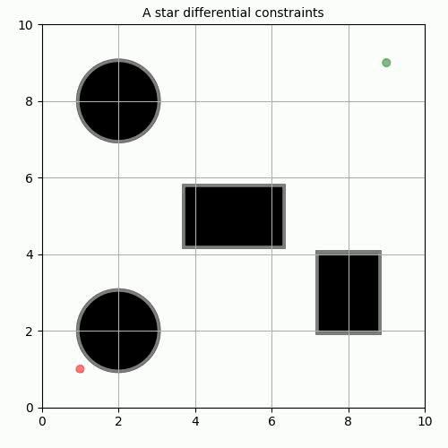
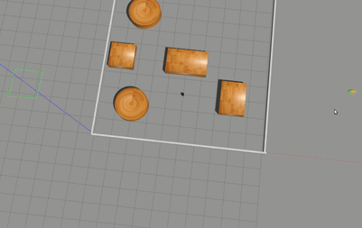

# AStar- with non holonomic constraints.

## Authors
```
Name: Aswath Muthuselvam
- UID: 118286204
- Section: 0201

Name: Gokul Hari
- UID: 117430646
- Section: 0301

- Course: ENPM 661 - Planning for Autonomous Robots
```

#  Part1: Visualization in Matplotlib 
Run 
```
python3 Astar_ddc.py
```




---------------------------------------------------
# Part2:  Visualization in Gazebo.

###  ROS package:
Refer the folder `./ros` for the ros package `astar_ddc`. Paste the ros package in your src folder of catkin workspace.

### Dependancies. 
run the following, to setup the dependancies in the catkin workspace- `catkin_ws`.

```
cd ~/ros_catkin_ws/src

git clone https://github.com/ROBOTIS-GIT/turtlebot3_msgs.git
git clone https://github.com/ROBOTIS-GIT/turtlebot3.git
git clone https://github.com/ROBOTIS-GIT/turtlebot3_simulations.git
```
make sure to paste this in `.bashrc` -   export TURTLEBOT3_MODEL=burger 

Run `cd ~/catkin_ws && catkin_make`

The following scripts are in the package's folder `astar_ddc/src` 
-  `Astart_ddc.py`
- `arena.py` 
-  `utils.py` 
- `open_loop.py` 

The node `publisher.py` is used to call the Astar planner to make the plan and obtain the waypoints. 
We have an `open loop publisher` that can apply the actions to the turtlebot.

To execute, run the command,
```
roslaunch astar_ddc environment.launch  
```




# Results:
For part 1, refer the following videos.
```
110-990.mp4
520-880.mp4
310-810.mp4
```

For part 2, refer the following videos.  
```
530-990.mp4
680-990.mp4
310-810.mp4
```
These videos are named `<start_state>-<goal_state>.mp4`, any state is given by (x,y, $\theta$)

## Future works
We are also working on a `closed loop publisher ` that can set the pose in each waypoint to be reached and  the model reaches it.
This is to be done with the help of actionlib and move_base.


# File structure.
```
├── arena.py
├── assets
│   ├── simulation_video.gif
│   ├── simulation_video.mp4
│   ├── 530-990.mp4
├── Astar_ddc.py
├── README.md
└── utils.py
```


