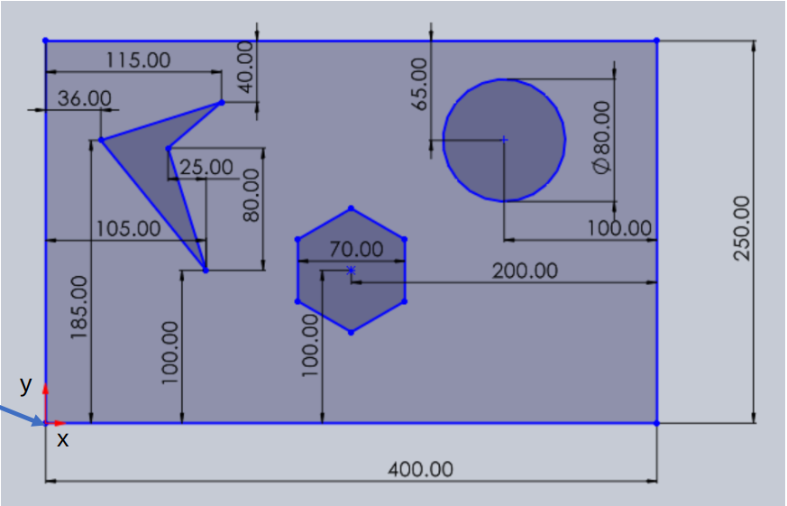

# Dijkstra Path Planning

This project involves path planning between intial and goal states in a 2D game-like environment using dijkstra algorithm. The visualization was done using `pygame`

Steps to run:

```
python3 Dijkstra-path-planning-gokul-hari.py
```
- Input the x and y location of the initial state
- Input the x and y location of the goal state.

This is the map in which the planning task is done:


Refer this github link for [code]() 
