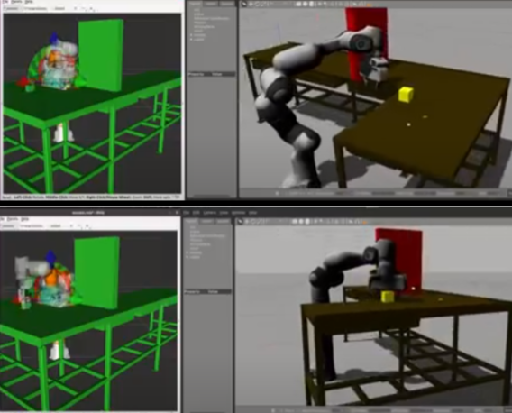

# Project 4 

```
- Name: Hari Gokul - 117430646
- Course: ENPM 661 - Planning for Autonomous Robots
```
## Results:

##### SnapShot:


### Video:
Video of grasping box object, planning around obstacle and placing the object is shown - 
[link](https://drive.google.com/file/d/1DHvCDz9HklTUPT6NB0TduuSxNFTrAaxp/view?usp=sharing).

##  Move it - Steps to run:
```
roslaunch panda_moveit_config demo_gazebo.launch

chmod +x  src/panda_pkg/src/

python3 src/panda_pkg/src/ik_pick_place.py

```

##  Move it - Steps to install:
```
rosdep update sudo apt update
sudo apt dist-upgrade

sudo apt install ros-noetic-catkin python3-catkin-tools

sudo apt install ros-noetic-moveit

cd <~>/catkin_ws/src

git clone https://github.com/ros-planning/moveit_tutorials.git -b master

git clone https://github.com/ros-planning/panda_moveit_config.git -b noetic-devel
cd ~/ws_moveit/src

## incase of error
sudo sh -c 'echo "deb http://packages.ros.org/ros-testing/ubuntu $(lsb_release -sc) main" > /etc/apt/sources.list.d/ros-latest.list' 
sudo apt update


rosdep install -y --from-paths . --ignore-src --rosdistro noetic

cd <~>/catkin_ws/
catkin_make


source devel/setup.bash

```

